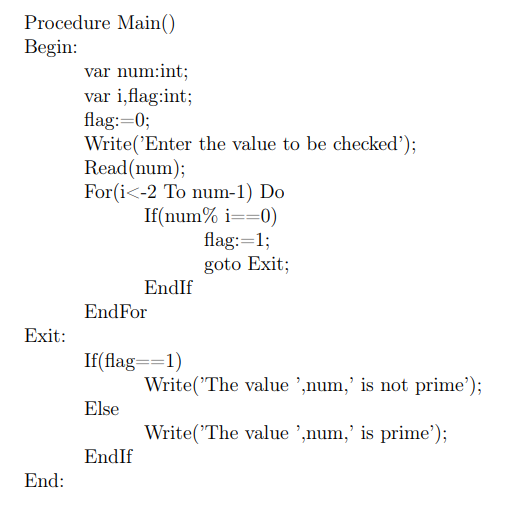
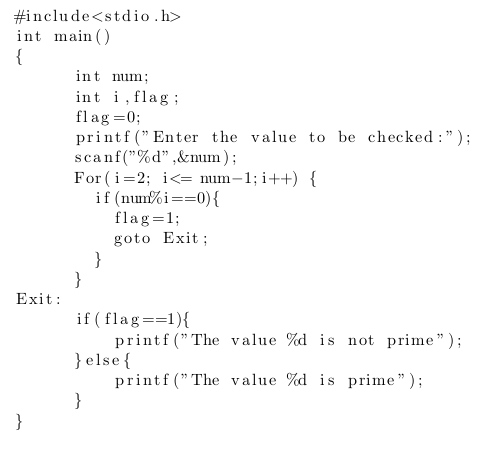

# Lex-Yacc-Language-Translator

My attempt at a language transalator to translate a custom language *C* to the equivalent C code
as part of the Compiler Construction course. The entire question file [here.](media/Assignment.pdf)

## To run the translator
Execute the 'translator' on an input from the 'inputs/' directory as `./translator < input1.txt`
Disclaimer: it doesn't work perfectly the Write().

## In case you'd like to work on the lex and yacc files, don't forget to compile them as follows
* `flex project.l`
* `yacc -dv project.y` (yacc is available by default on Linux, else use 'bison')
* `gcc -o translator lex.yy.c y.tab.c -lfl`

## Expected input and output

### Input

### Output

